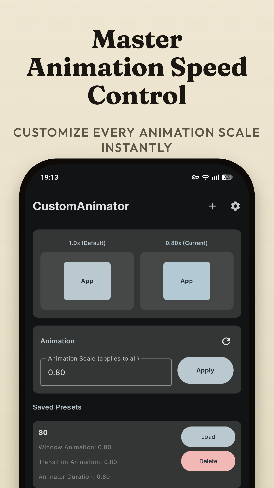
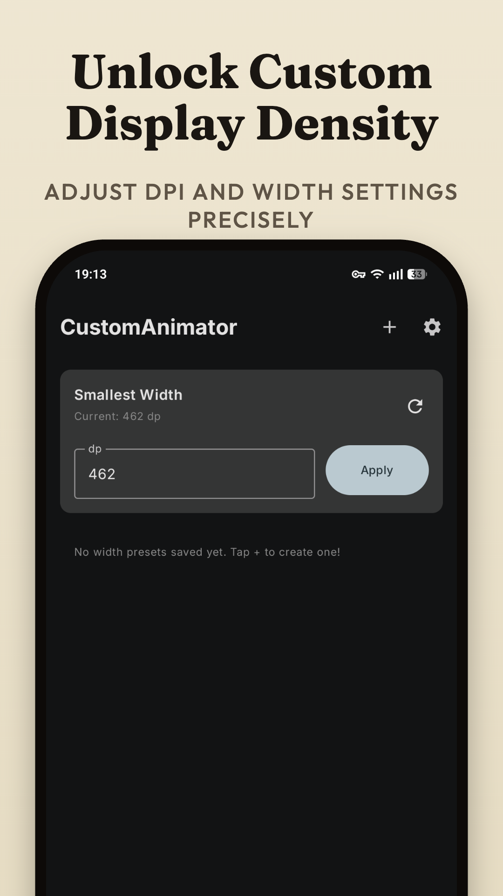
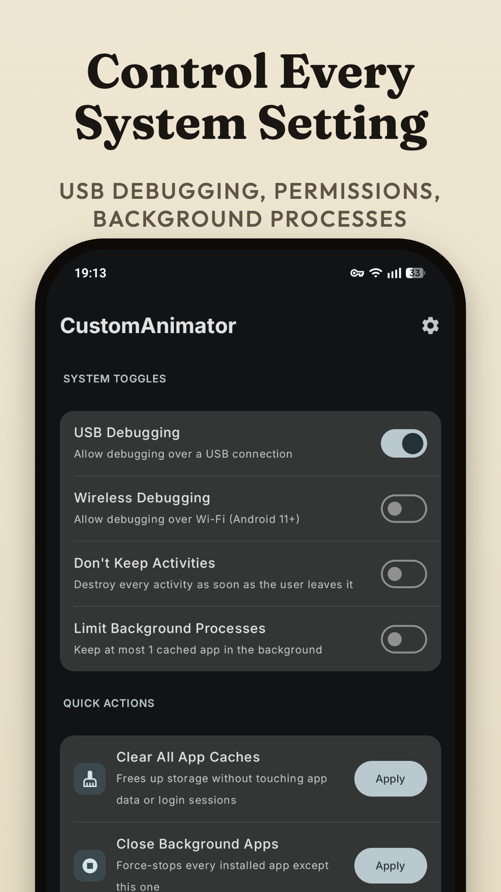
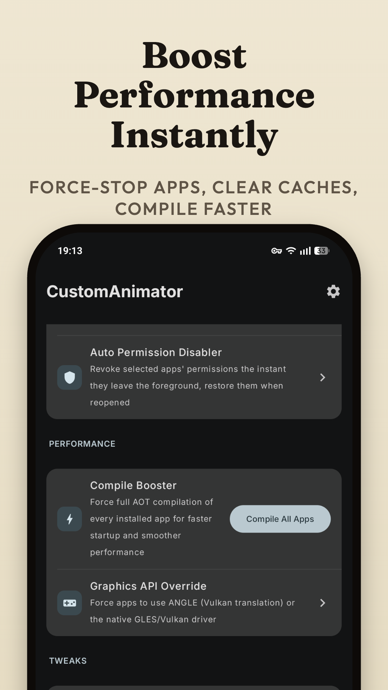
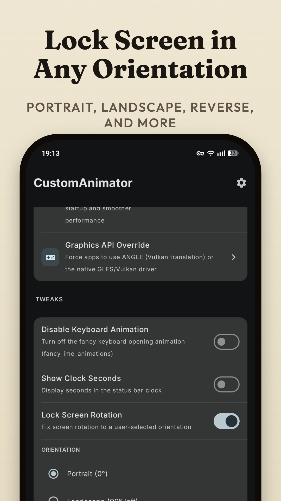
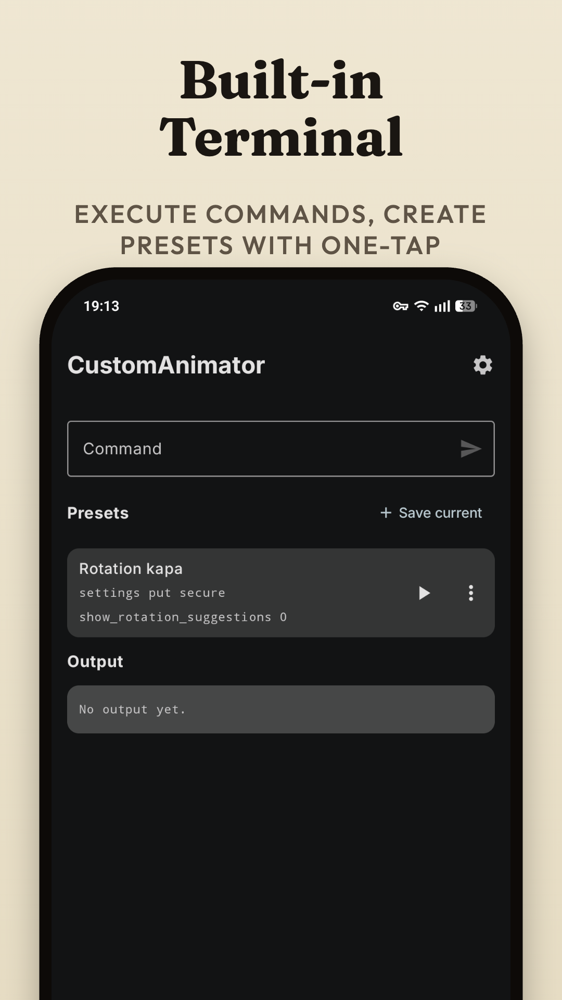
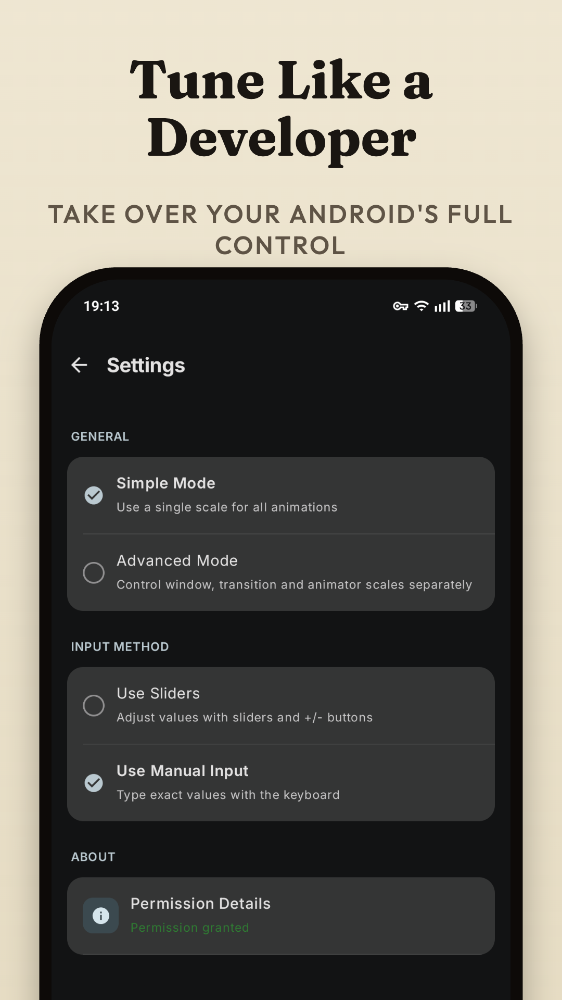

# Custom Animator

Custom Animator is an Android tweaking app for things Android normally buries in developer settings. It started as a way to fine-tune animation scales and display density (DPI) with custom values and presets, and has grown into a small toolbox of per-app and system-level tweaks — all without root.

  

## Screenshots

  
  
  
  
   
  
  
  

## Distribution

Custom Animator is distributed through the [Google Play Store](https://play.google.com/store/apps/details?id=com.arslan.customanimator) — that is the official channel for installing and updating the app.

## Support

- **Buy Me a Coffee**: [Support Development](https://buymeacoffee.com/ahmetcanarslan)

## Privacy

Custom Animator does not collect personal data or usage analytics; presets and settings stay on your device. The app serves AdMob banner and interstitial ads, which are subject to Google's own data handling; a one-time in-app purchase removes them. See [PRIVACY_POLICY.md](PRIVACY_POLICY.md) for details.

## License

Licensed under the GNU General Public License v3.0 — see [LICENSE](LICENSE).

---

**Note**: This app modifies system-level settings and can force-stop or alter other apps. Use with caution and test on your own device first.
